# Big Data project

### 1) Description of the problem

The main challenge tackled in this project was the management, filtering, and analysis of a large flight dataset to extract valuable insights such as minimum, maximum, and average prices for specific routes or dates. Additionally, the project aimed to provide tailored recommendations for the cheapest flights based on user-defined filters (e.g., departure airport or specific dates). This analysis is particularly beneficial for:

- **Consumers** looking for affordable flights.
- **Airlines** seeking to study price distribution to optimize pricing strategies.
- **Online travel platforms** aiming to enhance user experience.

The primary objective was to develop a scalable, high-performance system that leverages Big Data technologies and cloud infrastructure to:

1. Process large datasets efficiently.
2. Support dynamic, user-defined filters.
3. Produce comprehensive, user-friendly results saved in an output file.

While conceptually common, this problem required an advanced solution using Big Data tools like Apache Spark and distributed infrastructures to handle computational complexity and data volume.

### **2) Need for Big Data and Cloud**

Analyzing flight prices involves handling massive datasets, often comprising millions of flight records from across the globe. Each record includes details like departure and arrival airports, fares, dates, and other attributes. Combined, these data points create volumes that traditional tools like relational databases or desktop software cannot manage effectively. The complexity increases when users demand personalized results based on specific parameters such as dates or airports. This necessitates both significant computational power and scalable infrastructures capable of adapting to varying workloads.

The need for Big Data technologies is evident in this context. Apache Spark, a leading framework for distributed computing, was chosen for its ability to handle large-scale data and execute complex computations in parallel. Unlike traditional tools, Spark distributes workloads across machine clusters, optimizing execution times and enabling analysis of datasets larger than 1 GB, like the one used in this project.

The combination of Big Data and Cloud technologies is not just a technological choice but a necessity to address the scale and complexity of the problem. Without these, the analysis would be limited to small data subsets or require processing times incompatible with modern expectations. Using Spark and the Cloud allows not only for solving the current problem but also for developing a scalable solution adaptable to more complex scenarios or larger datasets.

### 3) Description of the data (Where does it come from? How was it acquired? What does it mean? What format is it? How big is it? 1 GB minimum).

The dataset, sourced from Kaggle, weighs approximately 1.8 GB and meets the size requirements for Big Data analysis. It is in CSV format, ideal for distributed processing with Apache Spark, and includes ten columns detailing various flight attributes. Key columns include `legId` (a unique identifier for each flight), `searchDate` and `flightDate` (indicating the search and flight dates), `startingAirport` and `destinationAirport` (the departure and arrival airports), and `totalFare` (the flight cost). Other columns provide information on travel duration, remaining seats, and distance. The dataset’s variety and size make it an excellent candidate for large-scale analysis, simulating a real-world Big Data scenario.
Dataset source: https://www.kaggle.com/datasets/dyliee/flight-prices-preprocessed

### 4) Description of the Application, Programming Model(s), Platform, and Infrastructure

The project was implemented using Apache Spark for the distributed processing of large datasets. The DataFrame model was chosen for programming as it enables efficient processing and automatic query optimization through Spark's Catalyst engine. This choice reflects the need to combine ease of use with high performance, especially for complex queries like those required by the project.

The execution infrastructure is based on Google Cloud Platform, using Dataproc to manage Spark clusters. The dataset, stored in Google Cloud Storage, is directly loaded into the cluster nodes to ensure fast and distributed access. The cluster configuration includes 4 workers, an optimal number to handle the workload without resource waste, while the driver coordinates the execution of tasks. Additionally, I optimized Spark's resources by properly configuring memory for both the executors and the driver. Specifically, I increased the memory for each executor to 4 GB and assigned 4 cores per executor, significantly improving data processing and reducing bottlenecks during execution.

This configuration, combined with the platform's inherent scalability, ensures high performance and competitive response times, even for large datasets. The entire system has been designed to be scalable, optimized, and easily extendable for potential future functionalities.

### 5) Software design (architectural design, code baseline, dependencies…)

The architecture follows a logical three-tier approach: data loading, query processing, and result generation. This separation allows each component to be isolated, facilitating potential modifications or future extensions.

The dataset is initially loaded from Google Cloud Storage using Spark APIs for reading CSV files. During this phase, the system leverages Spark's schema inference capabilities to automatically identify data types, reducing preprocessing time. Once loaded, the dataset is retained in memory to avoid unnecessary reloads and improve performance.

The core of the project lies in the filters and analyses applied to the data. The primary queries are based on Spark DataFrames, enabling a combination of computational efficiency and simplicity in writing transformations. Operations such as filtering, sorting, and aggregation are optimized through Spark's Catalyst engine, which automatically optimizes execution plans.

To provide additional suggestions, such as the cheapest flights by date or airport, specific queries are executed, also implemented using the DataFrame model. The output is then aggregated and formatted into a single text document saved in Google Cloud Storage, simplifying access to the final results.

The code is written in Python, utilizing Apache Spark's standard libraries and some native Python functionalities for managing output files. The primary dependency of the project is **PySpark**, the official package for using Spark with Python. Other dependencies include standard Python libraries such as `time` for performance measurement and `os` for managing file paths.

From an architectural perspective, the application is designed to run on a Spark cluster configured on Google Dataproc. This choice ensures scalability and efficient distributed processing. The design also adheres to programming and optimization best practices, including a customized cluster resource configuration and careful dataset management to avoid duplicates or inconsistencies.

### 6) Usage (including screenshots that demonstrate how it works).

The user can apply three filters, which integrate either an AND or an OR logic. It is possible to filter by date and by departure/arrival airport.

The input is provided as follows:

```jsx
analyze_prices(starting_airport="LGA", destination_airport="DTW", flight_date="2022-05-27")
```

The output is generated in a `.txt` file.

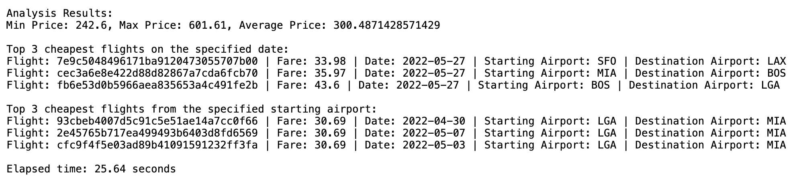

**Extra:** I implemented a search feature on the dataset that provides suggestions to the user based on their query, specifically the 3 cheapest flights for the selected date and the 3 cheapest flights from the departure airport.

## 7) Performance evaluation (speed-up with different number of vCPUs and nodes, identified overheads, optimizations done…).

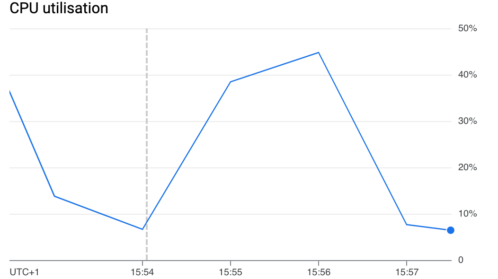

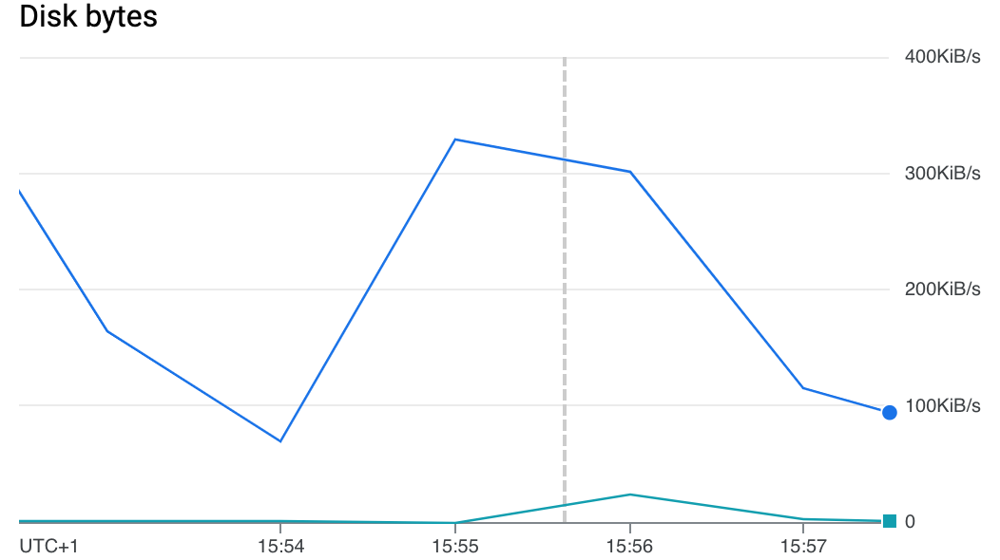

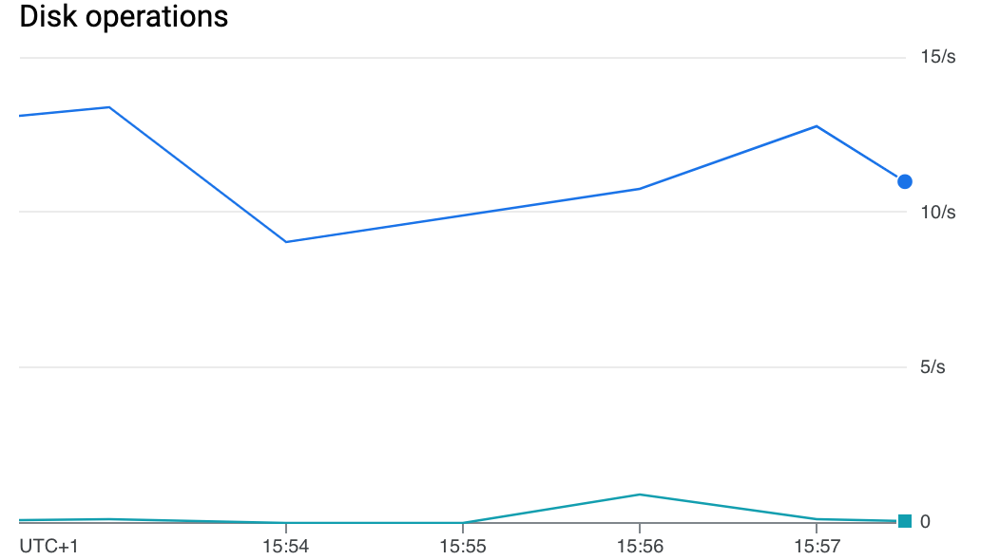

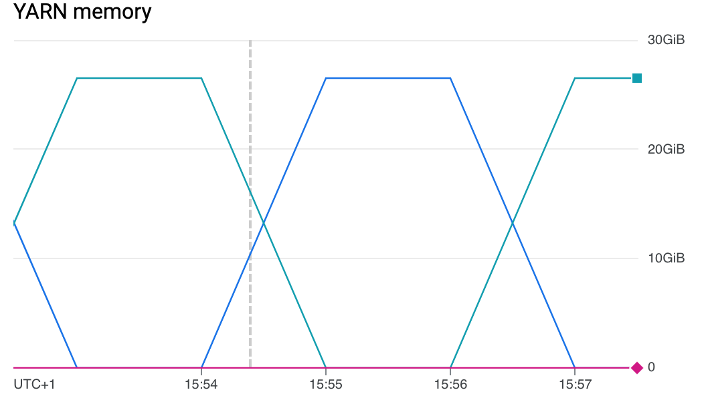

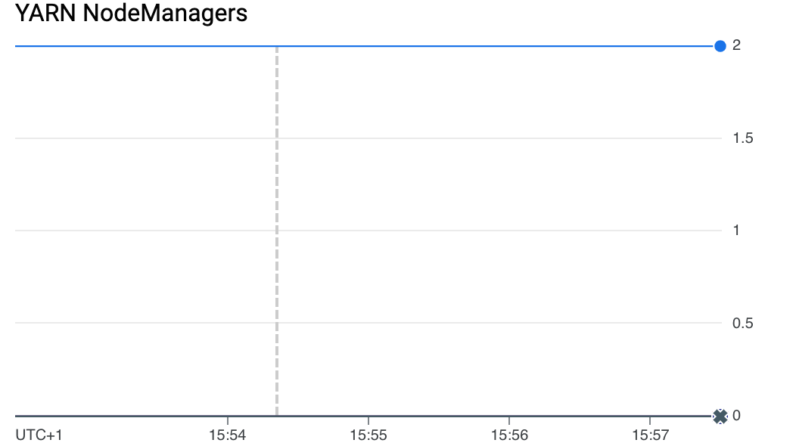

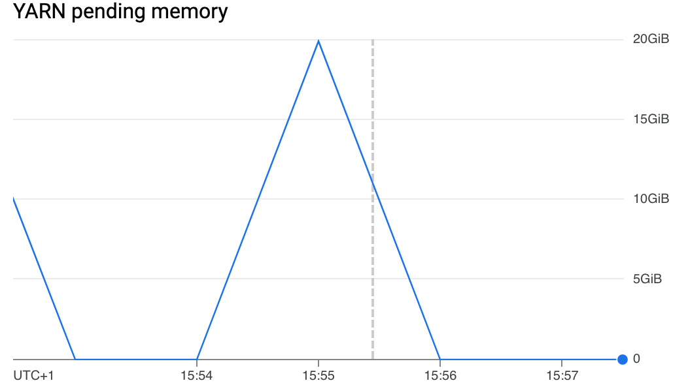

The analysis of Spark job metrics revealed inconsistent CPU usage, with peaks of 50% and frequent idle periods, likely related to I/O operations or suboptimal resource configurations. Disk activity was moderate, with peaks of 15 operations per second and decreasing throughput, suggesting that the job does not fully utilize the disk’s capabilities. YARN memory usage fluctuated between 0 and 30 GiB, indicating intermittent utilization, while peaks in pending memory highlighted slowdowns caused by resource contention.

To improve the performance of the Spark job, I implemented two main optimizations. First, I increased the number of cluster workers to 4, which allowed the workload to be distributed across more nodes, improving parallelization and reducing execution time. Second, I optimized Spark resources by properly configuring the memory for the executors and the driver. Specifically, I increased the memory for each executor to 4 GB and allocated 4 cores per executor to enhance data processing and minimize bottlenecks during execution.

### Optimization

```jsx
gcloud dataproc clusters update mycluster   --region=europe-southwest1   --num-workers=4
```

```jsx
gcloud dataproc jobs submit pyspark     --cluster mycluster     --region europe-southwest1     --properties spark.executor.memory=4g,spark.driver.memory=4g,spark.executor.cores=4     gs://practice1-436812_bucket/flight_price_analysis.py
```

## Re-evaluation and comparison

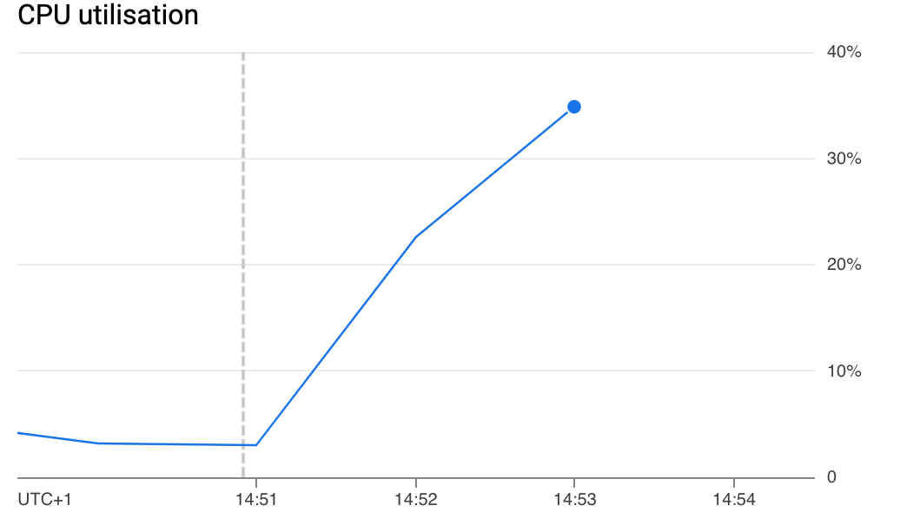

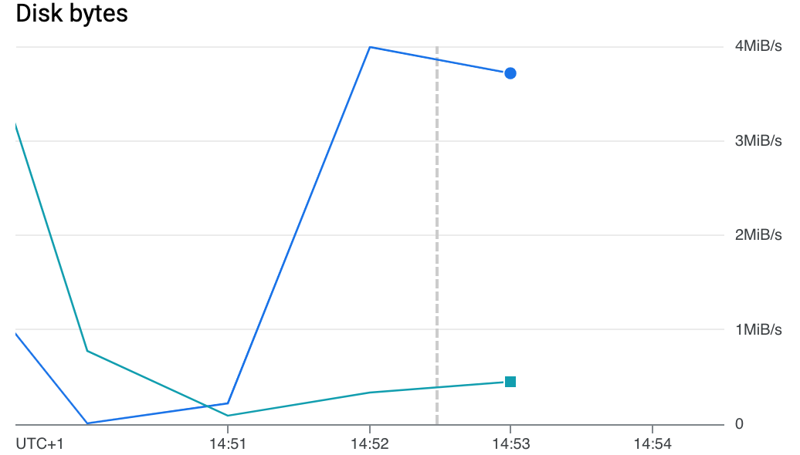

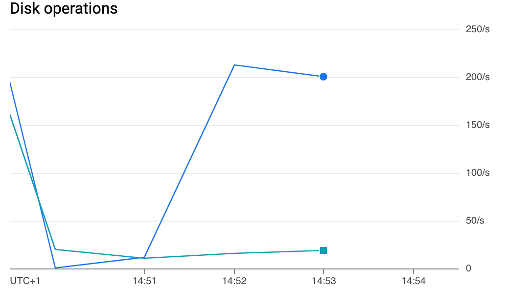

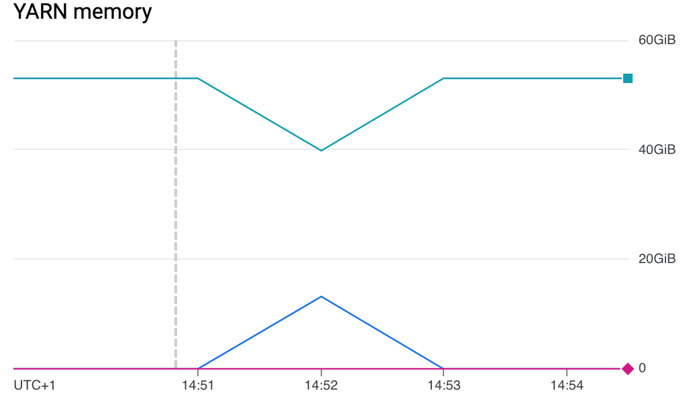

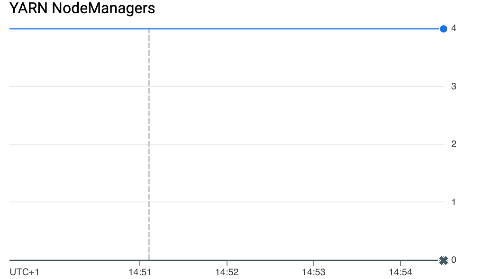

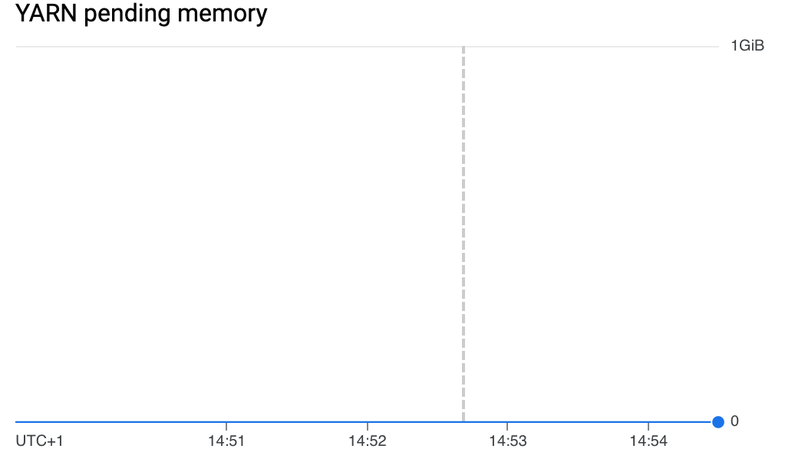

During the project, I analyzed system performance through tests on configurations with a different number of nodes. The first configuration, with two nodes, recorded an execution time of 36.46 seconds to process the dataset, while scaling up to four nodes reduced the elapsed time to 25.64 seconds. This improvement highlights a significant increase in efficiency thanks to the more advanced parallelization enabled by a greater number of nodes, demonstrating the importance of proper scalability in distributed systems.

Increasing the number of nodes allowed for better workload distribution, reducing bottlenecks and maximizing the cluster's resources. However, the improvement is not entirely linear due to the communication costs between nodes and the shuffle operations inherent in Spark's processing model. This phenomenon, known as parallelization overhead, is one of the main aspects to consider when optimizing big data applications.

In addition to increasing the number of nodes, I applied further optimizations to Spark resources by properly configuring memory and cores for each executor. These adjustments helped minimize processing overhead, further enhancing overall performance.

$$
Speedup = 36,46/25,64 ≈ 1,42
$$

## 8) Advanced features (tools/models/platforms not explained in class, advanced functions, techniques to mitigate overheads, challenging implementation aspects…)

To optimize the performance of my project, I implemented some advanced techniques, particularly to enhance efficiency on Spark and Google Cloud Dataproc.

First, I configured the cluster resources using the `gcloud dataproc jobs submit pyspark` command, allocating 4 GB of memory and 4 cores for each executor and driver. This configuration reduced bottlenecks and improved the processing of distributed data.

Additionally, I used the `.persist()` method for DataFrame caching, avoiding repeated recalculations and enhancing the efficiency of operations such as filtering and sorting flights. This optimization significantly contributed to reducing overall execution times.

### Conclusions (goals achieved, improvements suggested, lessons learnt, future work, interesting insights…).

During this project, I was able to achieve the goals I had set for myself: analyzing flight prices on a large dataset and doing so in a distributed manner using Apache Spark on Google Cloud Dataproc. I successfully obtained concrete results, such as calculating the minimum, maximum, and average flight prices, and I also created suggestions for the cheapest flights, filtering by date or departure airport.

One key takeaway from this work is the crucial importance of resource optimization in a distributed environment to achieve high performance. Additionally, careful attention to data management and operations in Spark is essential to avoid unnecessary slowdowns.

Looking ahead, there are several areas for improvement. One avenue to explore could be the introduction of predictive price analysis to estimate future costs.

### References

https://www.chaosgenius.io/blog/spark-performance-tuning/

https://spark.apache.org/docs/latest/api/python/reference/pyspark.sql/api/pyspark.sql.DataFrame.persist.html

https://cloud.google.com/blog/products/data-analytics/dataproc-job-optimization-how-to-guide

https://cloud.google.com/dataproc/docs/guides/performance-enhancements?hl=it
